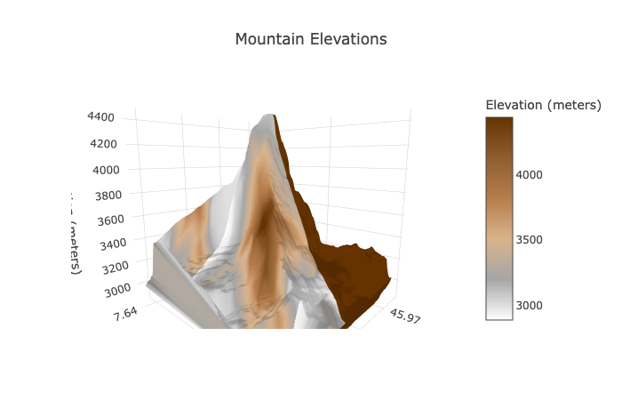
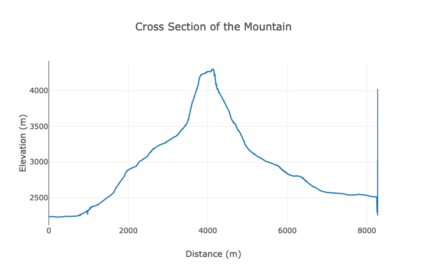

# Applicazione per la creazione di modelli meteorologici per il volo a vela

## Descrizione

L'applicazione è stata progettata per aiutare i piloti di volo a vela nella creazione di modelli meteorologici. 
Fornisce un rendering 3D e 2D di una montagna, una previsione d'onda(leewave) e una previsione dettagliata dell'innesco di una termica per il mondo del volo a vela.

## Caratteristiche

- Rendering 3D e 2D di una montagna

- Previsione d'onda(leewave) generalizzata
- Previsione dettagliata dell'innesco di una termica

## To-Do List

- Implementare il rendering del modello 3D e 2D di una montagna
- Generalizzare la previsione d'onda(leewave) per renderla applicabile a diverse situazioni meteorologiche
- Migliorare la previsione dettagliata dell'innesco di una termica per renderla più accurata e completa

## Licenza

L'applicazione è rilasciata sotto la licenza [MIT](https://opensource.org/licenses/MIT).	 
